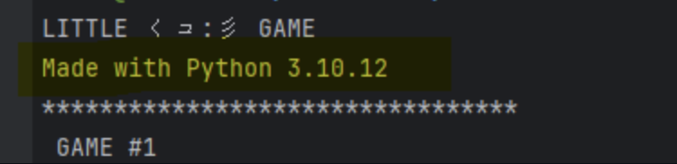
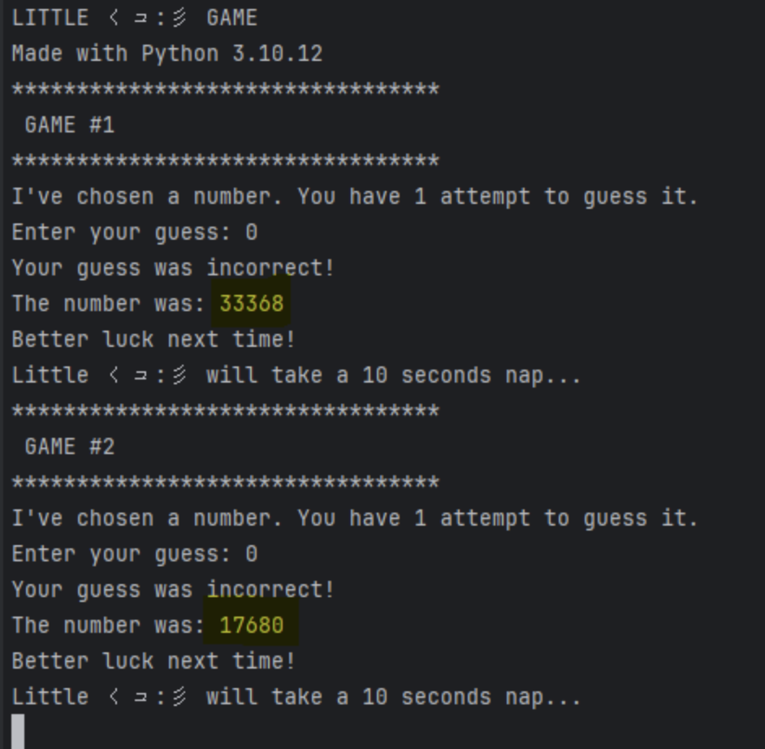

# Little Squid Game Writeup

- Pwn

## Description

Little くコ:彡 has picked a secret number for you, and you have 1 attempt to guess it right!

There are two ways by which you might get the flag: (1) being very lucky, or (2) being very hacky.

Btw, make sure to check `little-squid-game.py`

```py
#!/usr/bin/python3

import platform
import random
import time
from datetime import datetime

SLEEP_DELAY = 10

MIN_NUMBER = 0
MAX_NUMBER = 54321


def main():
    print("LITTLE くコ:彡 GAME")
    print(f"Made with Python {platform.python_version()}")
    random.seed(datetime.now().microsecond)
    game_counter = 1
    while True:
        print(f"*********************************")
        print(f" GAME #{game_counter}")
        print(f"*********************************")

        number = random.randint(MIN_NUMBER, MAX_NUMBER)

        print(f"I've chosen a number. You have 1 attempt to guess it.")

        while True:
            try:
                print(f"Enter your guess: ", end="")
                guess = int(input())
                break
            except ValueError:
                print("Invalid input. Enter an integer!")

        if guess == number:
            print("You guessed right!")
            with open('flag.txt', "r") as f:
                flag = f.read()
                print(flag)
            return
        else:
            print("Your guess was incorrect!")

        print(f"The number was: {number}")
        print("Better luck next time!")
        print(f"Little くコ:彡 will take a {SLEEP_DELAY} seconds nap...")
        time.sleep(SLEEP_DELAY)
        game_counter += 1


if __name__ == "__main__":
    main()

```

## Solution

(1) Make sure you're using the same python version as the one used in the game otherwise, the RNGs might behave differently.



**IMPORTANT: USE THE PYTHON VERSION THAT THE RUNNING CHALLENGE GIVES YOU, NOT THE ONE ON THE SCREENSHOT.**

(2) Fail 2 times (or more), and collect the generated numbers (for instance, 33368 and 17680)



(3) In solution.py, populate generated_numbers with the collected numbers:

```
generated_numbers = [
    33368,
    17680
]

```

```py
import random

# TODO: Update generated_numbers with the numbers you get.
generated_numbers = [
    33368,
    17680
]

MIN_NUMBER = 0
MAX_NUMBER = 54321

possible_seeds = []
for seed in range(0, 1_000_000):

    is_possible_seed = True
    random.seed(seed)
    for number in generated_numbers:
        if number == random.randint(MIN_NUMBER, MAX_NUMBER):
            continue
        else:
            is_possible_seed = False
            break
    if is_possible_seed:
        possible_seeds.append(seed)

if len(possible_seeds) == 1:
    random.seed(possible_seeds.pop())
    for i in range(len(generated_numbers)):
        random.randint(MIN_NUMBER, MAX_NUMBER)

    print(f'Next number to guess is {random.randint(MIN_NUMBER, MAX_NUMBER)}')

else:
    print(f'Bad news: multiple ({len(possible_seeds)}) possible seeds were found :(')
    print(f"Seeds: f{possible_seeds}")
    print(f'You gotta add extra generated numbers.')

```

(4) Execute solution.py. It should give you the next number.

```

Next number to guess is 35482

```

(5) Enter the number to the game, and get the flag.

**Thank you Anis Lounis for making soultion.md more clear.**

## Flag

ATHACKCTF{littl3_5quid_with_a_littl3_533d}
